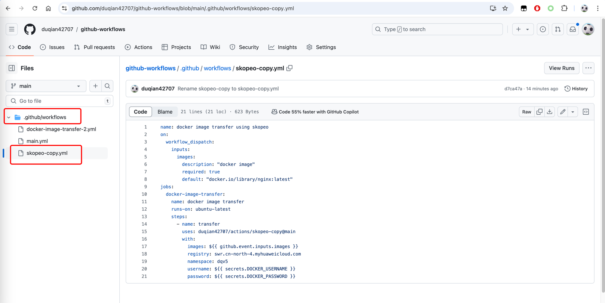
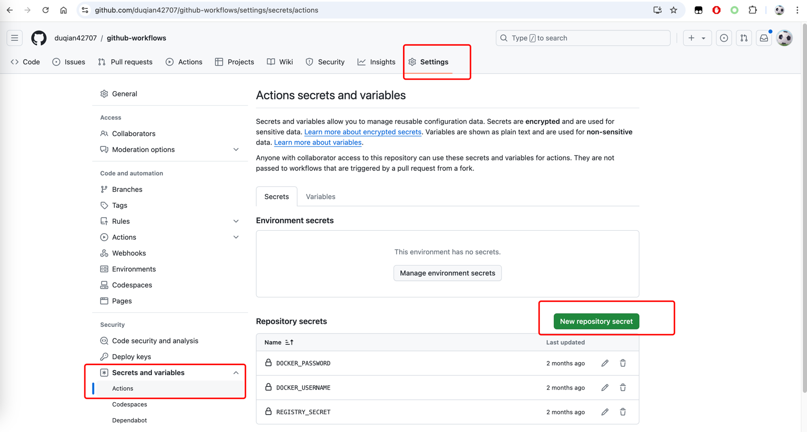
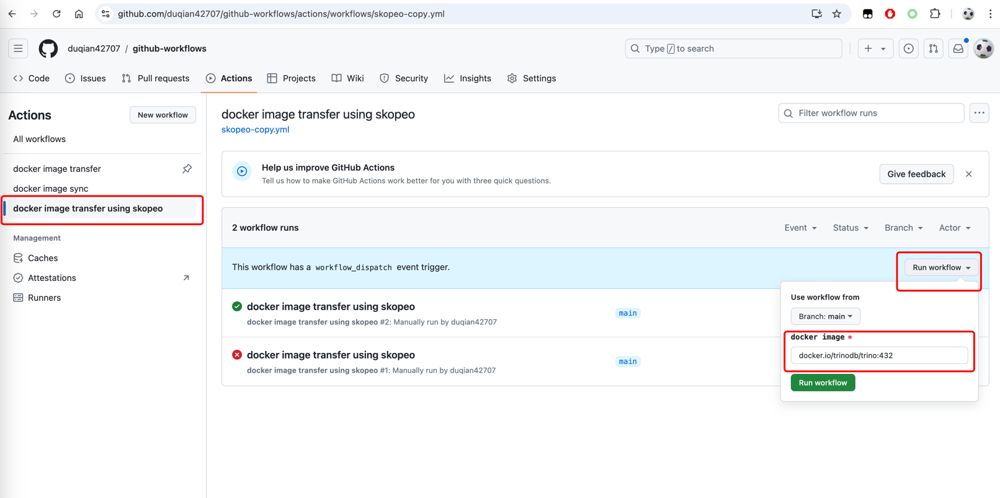
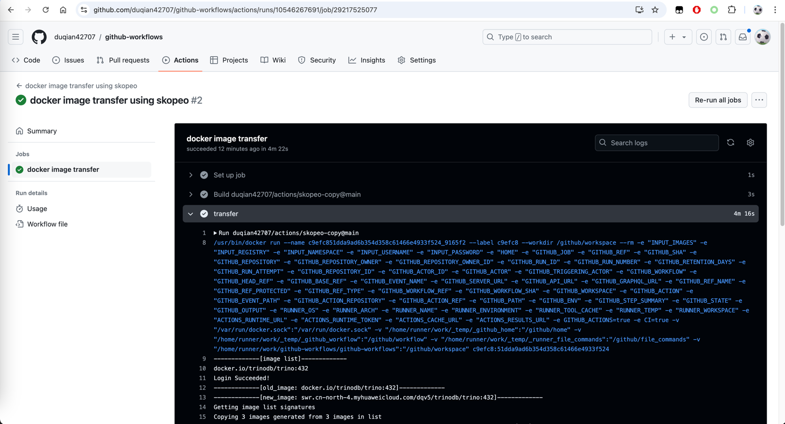

# docker image transfer using skopeo

## Usage

### Create a reposity, and add a github workflow. 



```yaml
name: docker image transfer using skopeo
on:
  workflow_dispatch:
    inputs:
      images:
        description: "docker image transfer using skopeo"
        required: true
        default: "docker.io/library/nginx:latest"
jobs:
  docker-image-transfer:
    name: docker image transfer
    runs-on: ubuntu-latest
    steps:
      - name: transfer
        uses: duqian42707/actions/skopeo-copy@main
        with:
          images: ${{ github.event.inputs.images }}
          registry: swr.cn-north-4.myhuaweicloud.com
          namespace: dqv5
          username: ${{ secrets.DOCKER_USERNAME }}
          password: ${{ secrets.DOCKER_PASSWORD }}
```
### Add repository secrets




### Start the action, and input the images you want to copy.




### Check the action logs.


